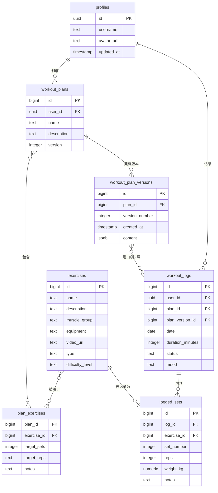

好的，这是基于优化后 PRD (v0.2.1) 的实体关系图（ERD）文档。

此版本包含了最关键的架构优化——建立训练日志与计划版本之间的直接关联，以确保数据的长期准确性和可追溯性。

-----

# 📊 训练计划网页实体关系图（ERD）文档 v0.2.1 (优化版)

## 1\. 引言

本文档版本为 v0.2.1，旨在为产品需求 v0.2.1 提供精准的数据模型支持。

相较于 v0.2 版本，本 ERD **最核心的优化**在于 `workout_logs`（训练日志）表中新增了 `plan_version_id` 字段。此举旨在将每一条训练记录与一个**不可变的计划快照**进行永久锁定，从而解决了因计划更新而导致的历史数据追溯不准确问题，是保障系统数据完整性和分析可靠性的关键基石。

-----

## 2\. 实体定义与属性（Entities）

-----

### **1. `profiles`（用户档案）**

  * `id` (UUID, PK) — 用户ID（关联 Supabase Auth）
  * `username` (Text, Unique, Not Null)
  * `avatar_url` (Text)
  * `updated_at` (Timestamp)

-----

### **2. `exercises`（训练动作）**

  * `id` (Bigint, PK, Auto-increment)
  * `name` (Text, Unique, Not Null)
  * `description` (Text)
  * `muscle_group` (Text) — 例如: chest, back
  * `equipment` (Text) — 例如: dumbbell
  * `video_url` (Text)
  * `type` (Text) — 例如: strength, cardio, mobility (建议使用 ENUM 或应用层校验)
  * `difficulty_level` (Text) — 例如: 初级, 中级, 高级 (建议使用 ENUM 或应用层校验)

-----

### **3. `workout_plans`（训练计划）**

  * `id` (Bigint, PK)
  * `user_id` (UUID, FK to profiles.id)
  * `name` (Text)
  * `description` (Text)
  * `version` (Integer, default: 1) — 指向当前最新的版本号

-----

### **4. `plan_exercises`（计划-动作关联）**

  * `plan_id` (Bigint, FK to workout\_plans.id)
  * `exercise_id` (Bigint, FK to exercises.id)
  * `target_sets` (Integer)
  * `target_reps` (Text) — 使用Text以支持"8-12"等范围
  * `notes` (Text)

-----

### **5. `workout_logs`（训练日志）** ✅ **核心优化**

  * `id` (Bigint, PK)
  * `user_id` (UUID, FK to profiles.id)
  * `plan_id` (Bigint, FK to workout\_plans.id, Nullable) — 记录该日志关联的主计划
  * **`plan_version_id` (Bigint, FK to workout\_plan\_versions.id, Nullable)** 🔹 **新增核心字段** — **锁定本次训练所依据的精确计划快照**
  * `date` (Date, Not Null)
  * `duration_minutes` (Integer, Nullable)
  * `status` (Text) — 例如: 状态良好, 疲劳 (用于疲劳度分析)
  * `mood` (Text) — 例如: emoji 或文本 (用于打卡感想)

-----

### **6. `logged_sets`（训练日志明细）**

  * `id` (Bigint, PK)
  * `log_id` (Bigint, FK to workout\_logs.id)
  * `exercise_id` (Bigint, FK to exercises.id)
  * `set_number` (Integer, Not Null)
  * `reps` (Integer)
  * `weight_kg` (Numeric)
  * `notes` (Text)

-----

### **7. `workout_plan_versions`（计划版本快照）** 🆕 **新增**

  * `id` (Bigint, PK)
  * `plan_id` (Bigint, FK to workout\_plans.id)
  * `version_number` (Integer)
  * `created_at` (Timestamp, with timezone, default: now())
  * `content` (JSONB) — 快照内容（包含动作/参数/备注等），使用JSONB以获得索引和查询优势

-----

### **8. `training_calendar_summary`（训练日历聚合视图）** 💡 **推荐使用视图**

  * `user_id` (UUID)
  * `date` (Date)
  * `log_count` (Integer)
  * `status_summary` (Text)
  * `mood_summary` (Text)
  * 📌 *该表建议通过 SQL 视图（VIEW）实现，聚合 `workout_logs` 表的数据，供前端日历快速调用，避免复杂查询。*

-----

## 3\. 实体关系图（Relationships）

-----

## 4\. 建议的索引与策略

| 表 | 字段 | 说明 |
| --- | --- | --- |
| `workout_logs` | `(user_id, date)` | **高频查询**：用于日历视图和历史日志列表。 |
| `workout_logs` | `plan_version_id` | **新增索引**：用于快速查找所有基于某一特定计划版本完成的训练。 |
| `exercises` | `(muscle_group, difficulty_level, type)` | **组合索引**：优化动作库的多维度筛选功能。 |
| `workout_plan_versions` | `(plan_id, version_number)` | **高频查询**：快速查找某计划的特定历史版本。 |

-----

## 5\. 行级安全（RLS）策略建议

RLS 的核心原则不变：**用户的数据只属于用户自己**。

| 表 | 策略描述 |
| --- | --- |
| `workout_logs`, `logged_sets` | 用户只能创建、读取、更新、删除属于自己 `user_id` 的日志数据。 |
| `workout_plans`, `plan_exercises`, `workout_plan_versions` | 用户只能对属于自己 `user_id` 的训练计划及其关联数据进行操作。 |
| `training_calendar_summary`（视图） | 视图的定义中应包含 `WHERE user_id = auth.uid()` 的过滤条件。 |